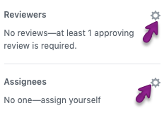
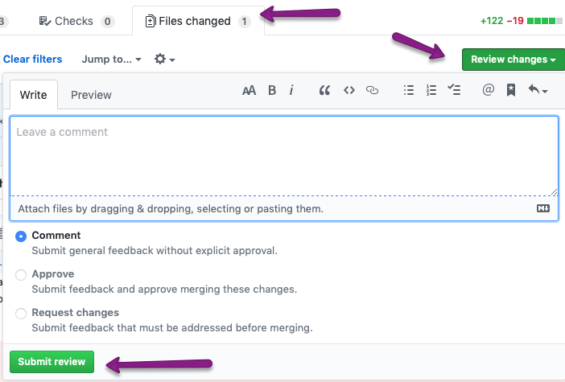
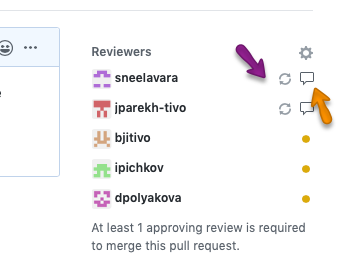

# How to contribute at TiVo #
## Background ##
The private github repository for ExoPlayer is internal to TiVo, here we stage possible contributions to the ExoPlayer Open Source project on [ExoPlayer GitHub](https://github.com/google/ExoPlayer).  

All contributions to ExoPlayer must go to lengths to share as much as is legally and businesswise possible with the open source community. It is not our goal to maintain a deviant fork of ExoPlayer.

## Initial Setup ##

### Setting Up Your Local Git ###
You need to setup access to this ExoPlayer private github, use the bot in the [#github Slack group](https://tivo.slack.com/archives/C6M9TSXH8) for this.

Next, clone this repository, then setup remotes for the GitHub repositories we track for ExoPlayer development.  From the command-line:

```
mkdir ExoPlayer
cd ExoPlayer
git clone -o tivo-pvt https://github.com/TiVo/ExoPlayer .
```
At this point you will have one *origin* remmote that is named `tivo-pvt` as upstream to this repository.

If you are working on code that will ultimately be shared with the ExoPlayer opensource (the most likely case), it is helpful to setup additional remotes to the two public GitHub repositories we will work with

1. [TiVo Corporate ExoPlayer Fork](https://github.com/TiVo/ExoPlayer) &mdash; The *tivo-public* repository, used to publish branches for pull requests.  Request push access from Alon Rohter
2. [Google's ExoPlayer GitHub](https://github.com/google/ExoPlayer) &mdash; *upstream*, the GitHub Google publishes ExoPlayer releases too, our ultimate goal for code changes is to live here.

To add both of these, use these commands:

```
git remote add tivo-public https://github.com/TiVo/ExoPlayer
git remote add upstream https://github.com/google/ExoPlayer
```

### Accessing Public Repository ###

Email Alon Rother for access to the `tivo-public` remote GitHub.  You must also be added to the [Google CLA](https://opensource.google/docs/cla/) in order to make pull requests with TiVo code, email Steve Mayhew for access to this and approval for sharing your specific changes.

## Making Changes ##
ExoPlayer is not a TiVo product, this is the mind set we want, the vast majority of changes will come from Google.  Our goal is to push all code changes we make (that are not proprietary) to *upstream* via the `tivo-public` github and pull requests.

### Public Changes ###
To share code back with Google, use the workflow in [Making Public Changes](#making-public-changes).  These changes fall into the following categories:
 
* _Bug Fixes_ &mdash; The vast majority of what we will do.  These should first be documented and reproducible.  Follow Google's template, [bug.md](https://github.com/google/ExoPlayer/tree/release-v2/.github/ISSUE_TEMPLATE/bug.md).
* _Extension Hooks_ &mdash; these are changes to the core of ExoPlayer that allow us to extend it or to add changes that may or may not be of interest to the community (proprietary DRM like VCAS).  An example is this change to enable VCAS (Commit [c4bb819](https://github.com/tivocorp/exoplayerprvt/commit/c4bb819192271a3650f6764e2c485738ce05081a)).  These are a long term liability if we cannot get the code to *upstream* so we should keep these to a minimum.
* _Non-Proprietary Enhancements_ &mdash; new features for ExoPlayer, for example HLS I-Frame only playlist parsing. Here we follow Google's template, [feature_request.md](https://github.com/google/ExoPlayer/tree/release-v2/.github/ISSUE_TEMPLATE/feature_request.md).  For these it is important to document the design copiously and include Google early and often in the process.  As an example, look at the enhancement for i-Frame only playlist, [Issue 474](https://github.com/google/ExoPlayer/issues/474) 

### Private Changes ###
* _TiVo Proprietary Changes_ &mdash; TiVo's own proprietary libraries and extensions.  These include:

	* `library-trickplay` &mdash; provides full screen trickplay with iFrame playlist
	* `library-ui` &mdash; the ExoPlayer ui components library
	* `demo-tenfoot` &mdash; our own private demo app
	* others TBS - please add here if you make a new one

For these, simply follow the [Making Private Changes](#making-private-changes) workflow.

## Branches ##
Branches are either release or topic branches.  Code should only be published from release branches.

### Release Branch ###
The `release` branch is the default branch in this private ExoPlayer repository.  `release` is the common trunk branch for all our shipping ExoPlayer code. This branch (and any `release-*` branch) is protected from push, to incorporate your code here you need to open a pull request.  The Jenkins build builds this branch.

Some consumers of the ExoPlayer libraries will keep [Alternate Release Branches](#alternate-release-branches) as appropriate to cherry-pick a subset of the released code tree bug fixes

At any time this branch will be based on a tagged ExoPlayer release from their [release-v2](https://github.com/google/ExoPlayer/tree/release-v2) branch (e.g. r2.9.6) plus:

1. Changes for features or bug fixes we are/have summited as pull requests to Google
2. Cherry-picked bug fixes from Google's dev-v2 branch that we need before they release them
3. local proprietary changes, in our specific libraries or extensions

The version of this branch will be based from the last merged Google release version.

### Alternate Release Branches ###
Any branch named `release-*` is suitable for releasing more restricted versions of ExoPlayer.  These branches are also protected from direct push, that is you need to open a pull request to have your code reviewed and committed to these.

For example, Hydra frumos releases may require a branch like `release-hydra-1.6` to cherry-pick a more controlled set of changes to ship with Hydra.

TBS how to manage version numbering for these? 

### Topic Branches ###
Developers cannot not push directly to `release-*` branches, but you can and must create and push a *topic* branch with the changes then issue a pull request to merge to a `release-*` branch.  

Issue this pull request early (as a Draft) in the process and solicit feedback from ExoPlayer project leaders to review the approach.  Note any developer can checkout your branch from your pull request and add commits to it, like a more refined perforce shelf.

Branches must be named `t-xxx` for topic branches, where `xxx` is a *descriptive* name for exactly what you are working on, this convention allows us to find and clean these up as needed.  

If your topic branch is for a *public change* (most likely case) follow the workflow for [Making Public Changes](#making-public-changes)

## Versioning ##

### Published Artifacts ###
The Gradle publish tasks publish the ExoPlayer libraries as Android libraries (aar files), along with source.  These are published to the local [TiVo artifactory](http://repo-vip.tivo.com:8081/artifactory/libs-release-local/).  The workflows section, [Publishing New Versions](#publishing-versions)

The libraries are described in the [README.md](https://github.com/tivocorp/exoplayerprvt/blob/release/README.md).  The TiVo internal library, [library-tivo-ui](https://github.com/tivocorp/exoplayerprvt/tree/release/library/tivo-ui) has an example of how to use ExoPlayer in TiVo and the libraries to include in your project, as well as TiVO specific libraries.

Code is built by Jenkins, [https://builds.tivo.com/view/Android/job/b-exoplayerprvt-release/](https://builds.tivo.com/view/Android/job/b-exoplayerprvt-release/)

TBS - versioning and publishing apk for demo-tenfoot?

### Version Numbering Scheme ###

The ExoPlayer libraries are integrated into other products as binary, so it is imperative that all releases are versioned.  TiVo will take a released version of ExoPlayer and include our proprietary changes along with any cherry-picked changes that are not yet released by Google.  Any version identification scheme must:

1. Identify the released ExoPlayer version that is base
1. Mark any TiVo additions as a patch version

ExoPlayer uses `major.minor.micro`, [ExoPlayer Releases](https://github.com/google/ExoPlayer/releases)
TiVo versions will add a `-` patch number and/or name to this. 

Some valid examples are:

* 2.11.4-1.0 &mdash; presumably first "released" version of TiVo's variant of ExoPlayer 2.11.4
* 2.11.4-hydra-1.6 &mdash; one example of how we might branch with a patch set specific to Hydra

In all cases, if the versions have a time ordering it should match up to the logic for [Gradle Versioning](https://docs.gradle.org/current/userguide/single_versions.html).  In the two examples above, the `-1.0` version is considered higher so clients would not pickup the hydra patch unless explicitly requested

It is assumed that most (if not all TiVo products will request explicit versions from the artifactory, e.g.:

```groovy
dependencies {
    implementation('library-tivo-ui:2.11.4-1.0')
}
```

Library APIs locked down to the major release.  So it is safe to wild card the minor release number, e.g.

```groovy
dependencies {
    implementation('library-tivo-ui:2.11.4-1.+')
}
```

## Workflows ##

### Making Private Changes ###
To make a change to TiVo proprietary code, simply create a new [Topic Branch](#topic-branches) from the `release` branch, make your changes and start a draft pull request to share them

### Testing Changes Locally ###
Often there is a need for trying local ExoPlayer build with Hydra application before publishing the final variant. For that local Maven repository can be used. Publish Exoplayer locally via:
```
gradlew publishToMavenLocal
```
Take note of the releaseVersion in constants.gradle and specify it when building Hydra by setting `USE_LOCAL_EXO_VER=<local-ver>` environment variable:
```
USE_LOCAL_EXO_VER=<ver> make cableco3-managed-qe
```

### Making Public Changes ###
Always the primary goal is to publicly publish (to the [TiVo Fork](https://github.com/TiVo/ExoPlayer)) all our bug fixes and changes to any Google owned modules (e.g. `library-core`, `library-hls`, etc).  

When you are in doubt, please check with Steve Mayhew.

Note Google's development is always based from their [dev-v2](https://github.com/google/ExoPlayer/tree/dev-v2) branch and our development is based from our [release](https://github.com/tivocorp/exoplayerprvt/tree/release) branch.  Thus sharing requires two parallel tracking branches.

For bug fixes, assuming you have searched [Google's Open Issues](https://github.com/google/ExoPlayer/issues) and not found the issue, start with creating public example media that demonstrates the problem then enter a bug for the issue, follow Google's template, [bug.md](https://github.com/google/ExoPlayer/tree/release-v2/.github/ISSUE_TEMPLATE/bug.md).

From here the steps are the same for both bugs and public features (assuming your remote names are setup as documented in [Initial Setup](#initial-setup))

Create branch to fix the problem in our tree:

````
git checkout release 
git checkout -b t-fix-xyz-bug
... make changes
git push -u tivo-pvt t-fix-xyz-bug
... go through pull request review
````

When you are ready, get approval to share the fix (bug fixes can always be shared), then create branch from Google's tree, convention is to name branch `p-x` where _x_ matches the private branch name, this will be important when you are keeping track of many of these

````
git checkout upstream/dev-v2
git checkout -b p-fix-xyz-bug
... find and cherry-pick the commits you need:
git log --pretty=format:"%h %ad | %s%d [%an]" --graph --date=short
git cherry-pick <COMMIT-SHA>
... Resolve, basically forward-porting the change to upstream/dev-v2
git push -u tivo-public p-fix-xyz-bug
... Open the pull request to Google, reference your bug or feature request.
````

Alternately you can start from `upstream/dev-v2` and back port the fix to our release branch.  Often this is a simpler workflow.

Once we update our local `release` branch with the latest version from *upstream* (Google) that includes your pull request (congratulations!), we compare against the (preserved) `t-fix-xyz-bug` branch and verify the change is as we published it.  At this point the cycle is complete and `t-fix-xyz-bug` branch can be deleted.  Keeping the branch around is helpful in resolving changes from Google vs our own local changes.

### Publishing New Versions ###
Before *publishing* a `release-*` branch you must update the reported version number.  For TiVo changes update the patch version, keeping the same base ExoPlayer version number. 

The reported version is in two places in the ExoPlayer code:

1. The gradle publish version number, two values in [constants.gradle](https://github.com/tivocorp/exoplayerprvt/blob/release/constants.gradle)
2. The [ExoPlayerLibraryInfo](https://github.com/tivocorp/exoplayerprvt/blob/release/library/core/src/main/java/com/google/android/exoplayer2/ExoPlayerLibraryInfo.java) class VERSION and VERSION_SLASHY

Both of these must be updated to the same number.  Specific steps are:

1. Create a new topic branch, `t-update-version-maj.min.micro-patch`. Only patch should change for TiVo code change releases
1. Update `ExoPlayerLibraryInfo.java` and `constants.gradle` (see above)
1. Use git history (`git log --pretty=format:"%h %ad | %s%d [%an]" --graph --date=short release`) to update the [RELEASENOTES](https://github.com/tivocorp/exoplayerprvt/blob/release/RELEASENOTES.md), follow the pattern
1. Submit the branch with a pull request, only these three files should be in the pull request
1. Once the pull request is complete, create a new release. Use [releases](https://github.com/tivocorp/exoplayerprvt/releases) 
1. Run the jenkins (TBS) task to publish the build 

### Pull Requests ###
Pull requests are the mechanism for sharing your changes with the community and soliciting a review, both internally in this TiVo private repository, and publicly with Google.  

This workflow is centered around TiVo, but working with public pulls is similar (the workflow is more restricted, as you will not have write access to Google's repository).

A pull request is like a code-collab, with these notable differences:

1. A pull request is backed by a branch, so any one can check out the branch make suggested changes and commit.
1. Unlike a code-collab, the code is already committed to version control, so the merge state (conflicts) is always visible

In pull request any team member can add a general comment and or file level comments. General comments are usually questions, clarifications or top level discussions. 
The pull requester can select one or more member of the team as reviewer/s. In Git all are optional reviewers. To merge the pull request at least one reviewer should approve the pull request.

The top level [Reviewing Changes in Pull Requests](https://help.github.com/en/github/collaborating-with-issues-and-pull-requests/reviewing-changes-in-pull-requests) gives and overview of the UI.

#### Creating Pull Requests ####
After sharing your branch by pushing it to a GitHub hosted repository, you should create a pull request.  Use the steps from [Creating the pull request](https://help.github.com/en/github/collaborating-with-issues-and-pull-requests/creating-a-pull-request#creating-the-pull-request).  The branches tab (e.g. [ExoPlayer private branches](https://github.com/tivocorp/exoplayerprvt/branches) should list your new branch with a button to create a pull request.

The basic steps for the author of the pull request are:

1. Create the pull request (or draft pull request)
1. Add a title and description (see [Pull Title And Description](#pull-title-and-description)) 
1. Add line comments (see [Adding Comments](#adding-comments) section) describing changes
1. Select reviewers and assignee (note this does not apply to the Google Repo)  

Once you select reviewers they are notified their review is requested via email.


##### Pull Title And Description #####
Be sure to create a meaningful title and description.  You should start with making your pull request a [Draft Pull Request](https://help.github.com/en/github/collaborating-with-issues-and-pull-requests/about-pull-requests#draft-pull-requests) until it is ready to merge.

##### Add Reviewers #####
Add reviewers and one person assignee (that person will have final review and merge the branch).  Use the gear icon to add a name:  

You have to navigate away from the text box (yes it's a fidgety UX) to commit the name.  Github only requires one reviewer to approve before merging, but please make sure everyone has completed the review first before the assigned person merges.

Once you assign people they will get an email to start the review and be able to see your comments.

### Adding Comments ###
In Github, got to the repository and find the `Pull Request` tab. All the open pull requests are listed there. Then click on the pull request you want to comment on

You should see the following tabs:

* `Conversation`
*	`Commits`
*	`Checks`
*	`Files Changed`

The help document [Commenting on a pull request](https://help.github.com/en/github/collaborating-with-issues-and-pull-requests/commenting-on-a-pull-request) outlines the steps for adding various types of comments.  You can:

1. Add line comments (in the `Files Changed` tab) like you would for a code-collab to describe the changes
1. Add general or overall comments (from `Conversation` tab)

The dialog action buttons are extremely confusing and poorly documented.  This [Edit Pull Request](https://zellwk.com/blog/edit-pull-request/) video and blog is somewhat clearer then the github documentation.  In short, the buttons:

* _Add single comment_ &mdash; adds a comment that everyone can see immediately
* _Start a review_ &mdash; lets you add comments and wait till you click start the review to expose them.
* _Resolve conversation_ &mdash; [Resolving conversations](https://help.github.com/en/github/collaborating-with-issues-and-pull-requests/commenting-on-a-pull-request#resolving-conversations) describes this, it's really not that meaningful for the TiVo private repository as everyone has write access to the repository.

Use "Start a review" if you are a reviewer and adding lots of comments then you can use the request review steps, [Submitting your review](https://help.github.com/en/github/collaborating-with-issues-and-pull-requests/reviewing-proposed-changes-in-a-pull-request#submitting-your-review), to indicate the next steps in the workflow.

### Reviewing Changes ###
This is substantially less clear from the GitHub UI, and the source of much confusion. The help document section [Reviewing proposed changes in a pull request](https://help.github.com/en/github/collaborating-with-issues-and-pull-requests/reviewing-proposed-changes-in-a-pull-request) explains the review process.

But basically you will: 

1. add comments, as described in [Adding Comments](#adding-comments)
1. Navigate to the _Files Changed_ tab
1. Click the green (_Review xxx_) button and you'll see this drop down 



Use the radio button to select the next state for the review then click _Submit review_ to publish your comments (which will message the reviewers)

The workflow state is displayed in the reviewer's list UI:



The orange arrow points to the link to show each reviewers comments, the speech bubble icon will show if they have left comments.   After responding to their comments the purple arrow points to a button to send the reviewer a message to request they read your response to their comments.

If a reviewer requested changes by selecting _Request changes_, the author has to request for the re-review. The review status remains _Changes Requested_ with red circle in the pull request’s _Conversation_ tab. 

The Author of the pull request has to scroll down to each change request and request for re-review. This can be done by clicking '…' at the end of the '<user> requested changes' line. The 're-review' option is visible only to the member who created the pull request. The status of the reviewer after this will change to “Awaiting requested review from <user>”.  

If you have a large number of pull requests active you can quickly filter the list to find your next steps for pull requests using the filters tabs.  See the 
[Filtering pull requests by review status](https://help.github.com/en/github/managing-your-work-on-github/filtering-pull-requests-by-review-status)


## Best Practices ##
Sections here talk about best practices for contributing to ExoPlayer development at TiVo

### Git Best Practices ###
Working with Git is a significant mental shift from perforce.  Mostly it is about becoming comfortable and courteous when working with **many** in-flight branches.


#### Commit Comments
When merging multiple branches and looking at branch history well formatted commit comments are critical.  Assuming you use `vi` (the GitHub desktop splits a separate subject and description text field) make the first line a short (50 chars or less summary, it has to fit in a tree view of git log) then add an empty new line, then more detailed description.

This is a pretty well written summary of how to make good commits:
https://www.freecodecamp.org/news/writing-good-commit-messages-a-practical-guide/

Make the text complete enough we can share publicly with the world, note when we cherry-pick them into public pull requests the TiVo internal stuff will get cleaned up, but better to explicitly add text along with links to stuff like JIRA issues. 

#### Rebase
The `git rebase` command is both powerful (allows 'clean' history) and evil.  The evil is:

1. Since commits are re-created it requires forced pushes, this makes sharing a re-based branch very difficult
1. It rewrites history in a way that obliterates the time ordering of things

For our TiVo private ExoPlayer respository pull requests should avoid using rebase unless reviewers explicitly ask for it.  The `release` branch moves slowly enough that it is overkill for most of what we do, and it is quite easy to make mistakes using rebase that are hard to see and harder to fix.

Rebase is required by the Google team for pull requests, it re-writes history in a way that reduces the number of open branches when there are **many** pull request branches in flight.  They will ask you to "rebase" your branch to `dev-v2`,  there are two ways to do this (assume your branch is `t-my-changes`

1. Checkout and merge upstream &mdash; 
  * `git checkout t-my-changes`
  * make sure your branch is clean (`git status`)
  * `git merge upstream/dev-v2` 

1. Rebase to `dev-v2`
  * same first two steps.
  * `git rebase upstream/dev-v2` 
  
The first (merge) will require you to resolve all the conflicts once, and keep history the same (an additional merge commit[s] will appear in your branch each time you bring in the changes in `dev-v2`

The second, rebase, forces you to merge and continue (`git rebase --continue`) for **every** commit in your branch.  Basically what it does is reset the branch point for your branch to the current HEAD of `upstream/dev-v2` and guide you through re-writing all your patches (commits) to fix any conflicts.


