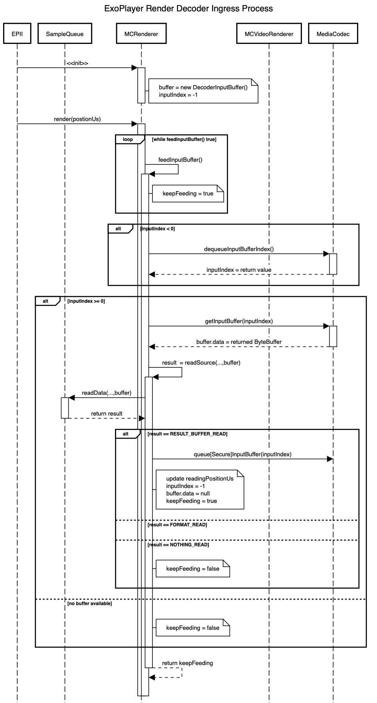
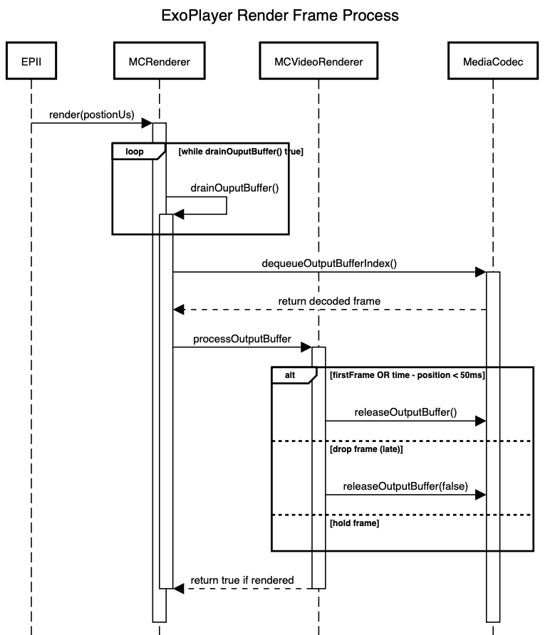

# ExoPlayer Tunneled TrickPlay Design

## Background

### Media Timing
#### ExoPlayer Media Position
Media Position drives all upstream media sample fetching and of course synchronized rendering of media samples.  It marches forward linearly unless a seek alters position (an external discontinuity) or playback is stalled (buffering on one or more media streams) or paused (by user or system control)

The internal class, `DefaultMediaClock` is created by the player and controls media position, it uses one of two implementers of [MediaClock](https://exoplayer.dev/doc/reference/com/google/android/exoplayer2/util/MediaClock.html) as the time source.  

1. The first enabled `Renderer` (typically this is audio)
2. A `StandaloneMediaClock`, if there is no enabled renderer that implements `MediaClock`

The [MediaClock](https://exoplayer.dev/doc/reference/com/google/android/exoplayer2/util/MediaClock.html) interface implemented by the audio renderer, it maintains `currentPositionUs` using the internal class `AudioTrackPositionTracker`.  The `AudioTrackPositionTracker` keeps track of the current audio playback position by a combination of multiple sources:

1. Polling the Android AudioTrack, the [getTimestamp()](https://developer.android.com/reference/android/media/AudioTrack.html#getTimestamp(android.media.AudioTimestamp)) method, following the recommendation to only call every 10 seconds.  
1. Before the first AudioTimestamp is returned, using the total frames queued to the AudioTrack ([getPlaybackHeadPosition()](https://developer.android.com/reference/android/media/AudioTrack.html#getPlaybackHeadPosition())
1. Between getTimestamp() intervals, the position is the 'smoothed' value of a series of calls to AudioTrack getPlaybackHeadPosition().
1. Lastly, any latency value (from calls getLatency() on the AudioTrack (a hidden API)) is subtracted out.

The bottom line is the [MediaClock.getPositionUs()](https://exoplayer.dev/doc/reference/com/google/android/exoplayer2/util/MediaClock.html#getPositionUs--) implementation in `MediaCodecAudioRenderer` returns the timestamp when the next audio sample is rendered, this drives position.

#### Playback Position Tracking
The internal method, `updatePlaybackPositions()`, updates the current position, either from reported discontinuity in the stream or calculating the new `renderPositionUs`

It calculates the `rendererPositionUs`, using the [MediaClock](https://exoplayer.dev/doc/reference/com/google/android/exoplayer2/util/MediaClock.html) which synchronizes time across the renderers. This is then normalized to the `periodPositionUs` in the current playing [MediaPeriod](https://exoplayer.dev/doc/reference/com/google/android/exoplayer2/source/MediaPeriod.html) and stored internally in `PlaybackInfo`.  This is the time available from the API [Player.getContentPosition](https://exoplayer.dev/doc/reference/com/google/android/exoplayer2/Player.html#getContentPosition--)

The [Player.getCurrentPosition()](https://exoplayer.dev/doc/reference/com/google/android/exoplayer2/Player.html#getCurrentPosition--) returns the current playback point as an offset in the current window. Time unit matches that passed to [Player.seek(positionMs)](https://exoplayer.dev/doc/reference/com/google/android/exoplayer2/Player.html#seekTo-long-)

This time is related to media/renderer time by a [Timeline](https://exoplayer.dev/doc/reference/com/google/android/exoplayer2/Timeline.html).  A live stream is typically manifest as a limited [Window](https://exoplayer.dev/doc/reference/com/google/android/exoplayer2/Timeline.Window.html), within the live [Period](https://exoplayer.dev/doc/reference/com/google/android/exoplayer2/Timeline.Period.html).  The [Timeline.getPeriodPosition()](https://exoplayer.dev/doc/reference/com/google/android/exoplayer2/Timeline.html#getPeriodPosition-com.google.android.exoplayer2.Timeline.Window-com.google.android.exoplayer2.Timeline.Period-int-long-long-) converts the current position in the window returned from the Player API to a period position and period, for the most common case, [SinglePeriodTimeLine](https://exoplayer.dev/doc/reference/com/google/android/exoplayer2/source/SinglePeriodTimeline.html), the returned value is the time in seconds since the start of playback.

#### Normalizing A/V Sample Times (PTS)
In HLS each [MediaChunk](https://exoplayer.dev/doc/reference/com/google/android/exoplayer2/source/chunk/MediaChunk.html) has a start and end time determined from the HLS playlist metadata (Program Date Time (or 0 if none) plus the durations leading up to the chunk).  This is source for media time in the player, it must line up with [Player.getCurrentPosition()](https://exoplayer.dev/doc/reference/com/google/android/exoplayer2/Player.html#getCurrentPosition--) and is the time basis for [Player.seek(positionMs)](https://exoplayer.dev/doc/reference/com/google/android/exoplayer2/Player.html#seekTo-long-)

The [TimestampAdjuster](https://exoplayer.dev/doc/reference/com/google/android/exoplayer2/util/TimestampAdjuster.html) normalizes timestamps (PTS) for each samples read by the MediaChunks.
This way, after loading a sample, time in all SampleStream sample buffers is in the same timebase as media position.

The first enabled sample stream wrapper in the MediaPeriod is declared *isMasterTimestampSource*, all other sample times are adjusted to it.  Chunks loading for non-masters waits for the master to load its first samples (for HLS, a segment) and call [TimestampAdjuster. setFirstSampleTimestampUs()](https://exoplayer.dev/doc/reference/com/google/android/exoplayer2/util/TimestampAdjuster.html#setFirstSampleTimestampUs-long-) with the `startTimeUs` for it's [Chunk](https://exoplayer.dev/doc/reference/com/google/android/exoplayer2/source/chunk/Chunk.html)

Once the *isMasterTimestampSource* has set the shared timestamp offset, related streams can continue processing their PES headers, and calls [TimestampAdjuster.adjustTsTimestamp(pts)](https://exoplayer.dev/doc/reference/com/google/android/exoplayer2/util/TimestampAdjuster.html#adjustTsTimestamp-long-) will normalize the timeUs values to the common stream time as well as dealing with PTS wrap. PTS wrap looks at last PTS across all the streams, thus multiple threads write `lastSampleTimestampUs` not sure if this is the desired behavior.

The life-cycle of a `TimestampAdjuster` is handled (for HLS) by the `TimestampAdjusterProvider` this object creates and stores a set of `TimestampAdjuster` objects keyed to the DSN (Discontinuity Sequence Number) of each `MediaChunk`.  So a set of `MediaChunk`'s in the same discontinuity set share a common `TimestampAdjuster`.

### Non-Tunneled Frame Timing

## Renderer
The render cycle calls Renderer.render() for each active renderer. This is done in a main playback activity handler.  The top of this activity loop updates the `renderPositionUs` (see [Media Timing](#media-timing) and passes it as `positionUs` to the main render method for each active renderer

~~~java
render(long positionUs, long elapsedRealtimeUs) 
  - while (drainOutputBuffer(long positionUs, long elapsedRealtimeUs)) {}
  - while (feedInputBuffer() && shouldContinueFeeding(drainStartTimeMs)) {}
~~~

This render loop runs the [MediaCodec Synchronus Mode](https://developer.android.com/reference/android/media/MediaCodec#synchronous-processing-using-buffers) algorithm, prioritzing rendering over feeding decoder input.
 
- `feedInputBuffer()` - feeds data from the SampleStream to the video codec, see [Renderer Input Processing](#renderer-input-processing) to decode into video frames ready to be rendered to the surface.  
- `drainOutputBuffer(positionUs, elapsedRealtimeUs)` - handles frame release, see [Renderer Output Processing](#renderer-output-processing)

<div style="page-break-after: always;"></div>

#### Renderer Input Processing
ExoPlayer's render process feeds media samples from the SampleQueue to MediaCodec as fast as possible, throttled by only two conditions:

1. Availability of media samples from [SampleStream.readData()](https://exoplayer.dev/doc/reference/com/google/android/exoplayer2/source/SampleStream.html#readData(com.google.android.exoplayer2.FormatHolder,com.google.android.exoplayer2.decoder.DecoderInputBuffer,int))
2. Decoder input buffer availability.

For trickplay it is expected the MediaCodec will decode frames as near realtime as possible.  Output processing controls timing of the actual frame render.

The sequence diagram below shows the main processing for renderer input



#### Renderer Output Processing
Audio plays as continuously, as long as playback is not stalled (download stalls) or paused (user control)

Video frame release is throttled by the Media Time, the computation of this described in the Media Timing section above.  The sequence diagram below shows 




## Solution Overview

### Tunneled Playback And Trick-Play

MediaCodec tunneled playback requires an audio track which is marked with matching video timestamps (sync headers).  This process is described in overview by the [Tunneled video playback in ExoPlayer](https://medium.com/google-exoplayer/tunneled-video-playback-in-exoplayer-84f084a8094d) article.  Bottom line is the requirement for an audio track, for high speed trickplay this is simply not possible with standard tunneling mode.

Broadcom has provided an API to set the tunneling video codec to time frame release without using an audio track as reference:

**MIKE  add some text here how it works


### Managing Playback Time
With this video only tunneled playback mode the current (non-tunneled) trick-play method, that is changing the speed of the `StandaloneMediaClock` to cause fast playback, will no longer work reliably to maintain a relationship between the displayed frame and the current Media Position.

Since now the Broadcom tunnel video codec is in charge of frame release timing there are a couple of issues to resolve:

1. There is no control matching the progression of `StandaloneMediaClock` so it matches with the timestamp of the release frame, this is because [Renderer Output Processing](#renderer-output-processing) does not run.
2. Encoded samples read from the `SampleStream` must be filtered and possibly discarded if they will exceed the target displayed frame rate

#### Broadcom Requirements

This should be possible to incorporate this mode, with full support of the features in our current TrickPlay, as long as the Broadcom tunneled video codec supports the following:

1. First IDR frame queued to `MediaCodec.queueSecureInputBuffer()` (or queueInputBuffer() if clear) following a call to `MediaCodec.flush()` must render immediately (< 10ms)
2. Subsequent IDR frames must render at the requested frame rate, ignoring timestamps
3. All rendered frames must be reported, with their timestamp, to [MediaCodec.OnFrameRenderedListener](https://developer.android.com/reference/android/media/MediaCodec#setOnFrameRenderedListener(android.media.MediaCodec.OnFrameRenderedListener,%20android.os.Handler))


#### ExoPlayer Changes
The TiVo subclass of `MediaCodecVideoRenderer` will need to override and extend the base class to handle these changes.  This includes:

1. Implementing `MediaClock` to provide update Media Position as true to the render position
2. Trottle and filter the input media samples fed to MediaCodec decoder input side

The only knobs we have to control this is to throttle the input side (`feedInputBuffer()`) based on:

1. The timeUs in the read buffer relative to the current Media Position
2. If enough frames are fed to the MediaCodec in order to maintain the BCM frame rate.

It should be possible to control this by overriding one ore more methods in `BaseRenderer` in our own subclass (`TrickPlayAwareMediaCodecVideoRenderer`).

To control the input side of the equation `BaseRenderer.readSource()` (see the overview in [Renderer Input Processing](#renderer-input-processing)) we need
to:

1. prevent (defer) queuing buffers far enough in the future (pasted a threshold value) 
2. discard buffers that would exceed the frame rate

A pseudo code overview of how `feedInputBuffer` would work (in forward mode) to do this is and how to implement `MediaClock` using the call back (requirement #3) follows:

```java

long deferredReadBufferTimeUs = C.TIME_UNSET;
long currentPositionUs = C.TIME_UNSET

@Override
protected void onPositionReset(long positionUs, boolean joining) throws ExoPlaybackException {
	super.onPositionReset(positionUs, joining);
	currentPositionUs = positionUs;
}

@Override
protected int readSource(FormatHolder formatHolder, DecoderInputBuffer buffer, boolean formatRequired) {
	int result;
	if (deferredReadBufferTimeUs == C.TIME_UNSET) {
			result = super.readSource(FormatHolder formatHolder, DecoderInputBuffer buffer, boolean formatRequired);
			if (result == C.RESULT_BUFFER_READ) {
				if (currentPositionUs != C.TIME_UNSET && buffer.timeUs - currentPositionUs < "frame rate") {
				    buffer.data = null;	   // TODO - need to discard current decoder buffer data
					result = C.NO_DATA_READ;
				} else	if (check buffer.timeUs - current media position > "threshold value") {
					deferredReadBufferTimeUs = buffer.timeUs;
					result = C.NO_DATA_READ;
				}
			}
	} else {
		if (deferredReadBufferTimeUs - current media position > "threshold value") {
			deferredReadBufferTimeUs = C.TIME_UNSET;
			result = C.RESULT_BUFFER_READ;
		}
	}
	return result;
}

// TODO - if this is not called reliably we will need a workaround that looks at the last input time instead otherwise
// TODO   position will not update and playback will stall.
@Override
protected void onProcessedTunneledBuffer(long presentationTimeUs) throws ExoPlaybackException {
	currentPositionUs = presentationTimeUs;
}

```

TODO:

1. deal with details of format change (C.RESULT_FORMAT_READ)
2. handle discarding non IDR read samples before switch to iFrame only track


