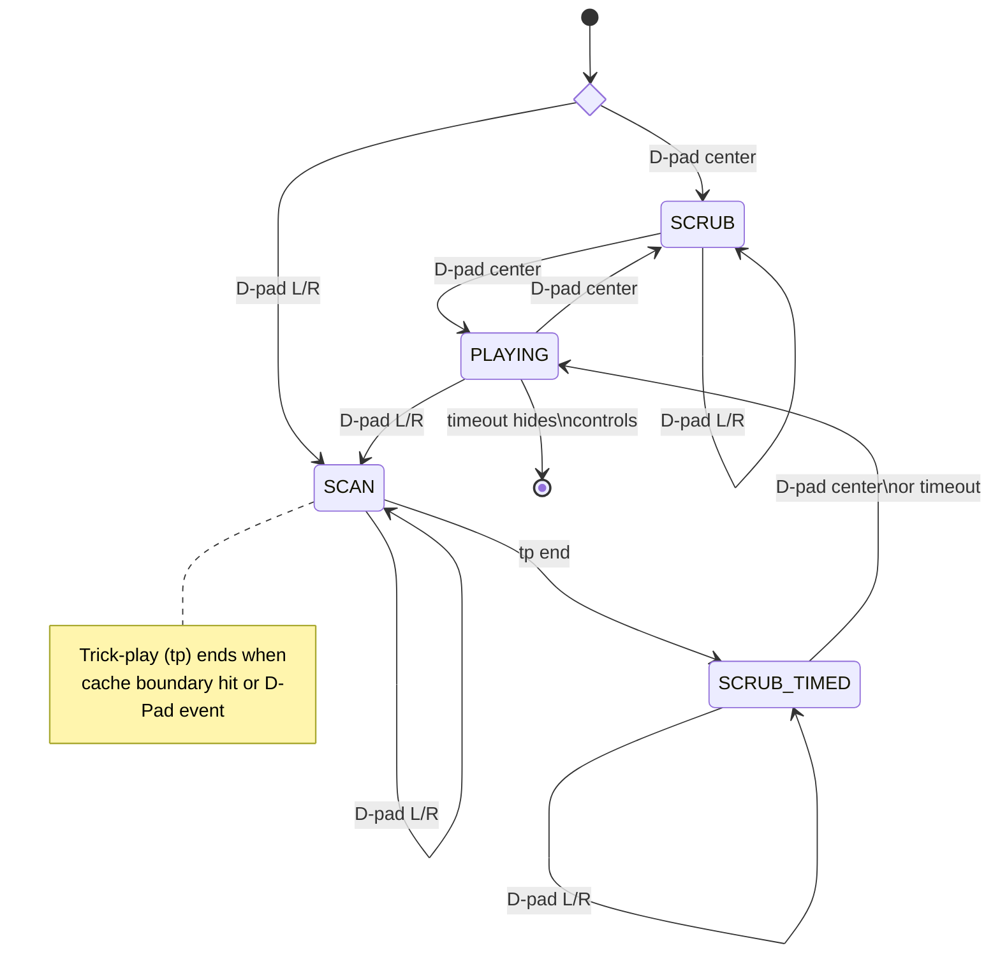

#### Dual Mode Trick-Play D-Pad UX

##### Summary

This document describes the changes in the ExoPlayer Tenfoot Demo program to enable demoing various trick-play UX that is initiated with D-PAD only.  The Dual Mode Visual Trickplay document describes Dual Mode, as a reminder, the modes are:

1. *Scrub Mode* &mdash; allows fine grained frame level stepping with user input (scrub bar, track pad, remote keys, etc) 
2. *Scan Mode* &mdash; automatically plays selected frames in high speed forward or reverse at a moderate frame rate (3 - 6 FPS). The traditional TiVo trick-play.

##### Candidate UX Methods

Each of the following UX methods can be selected from a drop down in the main window of the program (or by sending an explcit play intent to `ViewActivity`, View intent extra, `scrub_behavior`.)

Common keys for all methods are:

* *Info* &mdash; this key toggles the trick-play controls visible state without changing the playback state at all

* *Back* &mdash; this key hides the trick-play controls and enters normal playback state, it exits playback completely if the trick-play controls are not shown
* *D-Pad Center* &mdash; toggles play / pause, in some modes exits SCAN mode trickplay

The methods are selected using the view intent extra, `scrub_behavior`.  The `scrub_behavior` values are:

1. `scrub_only` &mdash; This mode is just demos *Scrub Mode*, where D-PAD movements change the position (scrub)
2. `scrub_lp_vtp` &mdash; Adds long press to transitions to *Scan Mode*.  Hold time increases the speed
3. `scrub_dpad_morph` &mdash; Basically make the D-Pad modal, entry key defines the initial mode.  In *Scan Mode* the D-pad acts just like the traditional TiVo series 6A remote transport D-pad.

The methods are described in the following sections.

###### Scrub Only

This method (`scrub_only`) is just a degenerate demo of *Scrub Mode* only mode, where D-PAD movements change the position LEFT back and RIGHT forward.   Note for a D-PAD based remote the Android key-repeats will generate some frame rate and repeate the scrub direction.   This mode may really only useful for phone UI where a touch bar is the primary input source, it is very simple but limited in the rate it can move trick-play

###### Long Press Increments

This method is set with `scrub_lp_vtp`.  Like Scrub Only except that long press on D-Pad L/R transitions to *Scan Mode* and speed increases the longer the D-Pad key is held.  Releasing the D-Pad key exits to *Scrub Mode*.  

###### D-Pad Morph to Transport Control

This method effectively merges the functions of the single D-Pad and the "Transport Controls D-Pad" on the S6A TiVo remote togeather in a modal fashion.  When the Dual Mode is *Scan Mode* the D-Pad functions as the S6A Transport Controls (Left = rewind, right = FF, Center = Pause, and Up is Play), when in *Scrub Mode* the D-Pad functions to single step frame by frame with Left / Right and Center is play/pause toggle.

##### Internals

Internally the two Dual Mode modes (*Scrub Mode* and *Scan Mode*) are managed along with the trick-play and play / pause state with the following state diagram and following description

* `NONE` (&#9210;) &mdash; the entry / exit state, before any trickplay operation is started.  When the player controls are shown with this state their is no auto hide timer active.  This state is set when the auto hide timer hides the player controls
* `SCRUB` &mdash; this state is the *Scrub Mode* state, playback is paused in this state and the direction gestures (D-Pad Left and RIght) move the position iFrame by iFrame.  These conditions enter this state:
  1. *D-Pad center with controls hidden* &mdash; The controls show on the D-PAD Center keyevent then the time bar will get focus, playback is paused in `SCRUB` mode.   The auto hide timeout is set to infinate in this state
  1. *D-Pad center* `SCAN` *mode with timebar focused*  &mdash; This state is one exit for trick-play, here the user is given the chance to correct for over or undershoot.
  1. *D-Pad center* `SCRUB`  *mode with timebar focused* &mdash; here the D-Pad center toggles play/pause.  If the action starts playback we transition to the `PLAYING` state. 
* `SCRUB_TIMED` &mdash; This state is used for over/under shoot correction at the end of *Scan Mode* trick play.  It is entered from `SCAN` with trick-play off and playback not paused, if the user does a D-pad Left or Right frame by frame playback starts in paused state, like regular `SCRUB` mode.  The difference is, after a short timeout or D-Pad center, playback will go from pause to play and enter `PLAYING` state. 
* `SCAN` &mdash; this is the trick-play state, playback will be in forward or reverse trickplay and the D-Pad Left/Right control the speed.   No auto hide timer is active so controls remain visible.  Any condition that exits trick-play or user action (e.g. D-Pad center, D-pad UP) will exit to `SCRUB_TIMED`
* `PLAYING` &mdash; this state is the timed exit to playback state. In this state D-Pad Left/RIght will transiton to `SCAN` state and begin trick-play in the appropriate direction.  The controls auto hide timer is active

